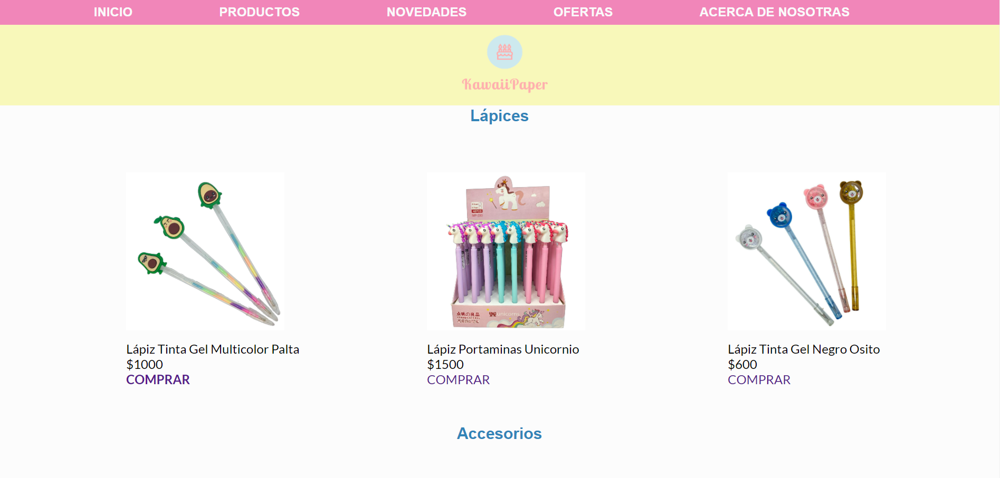
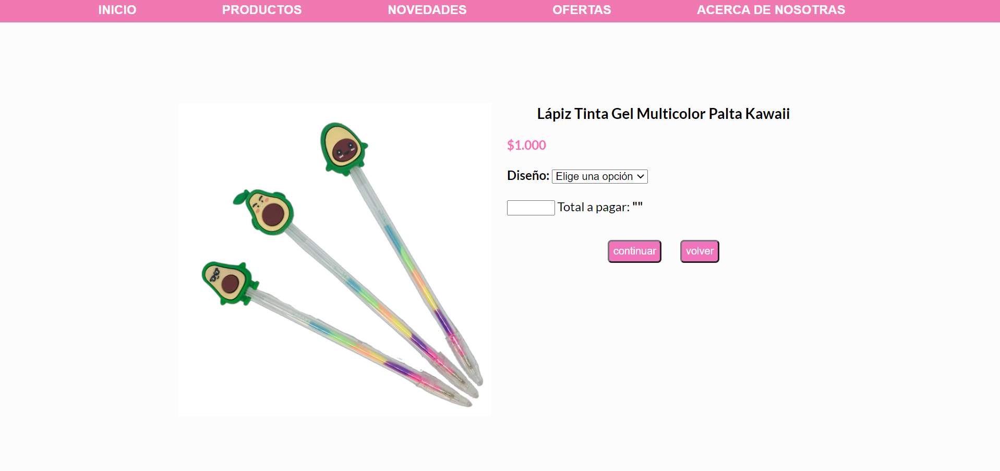
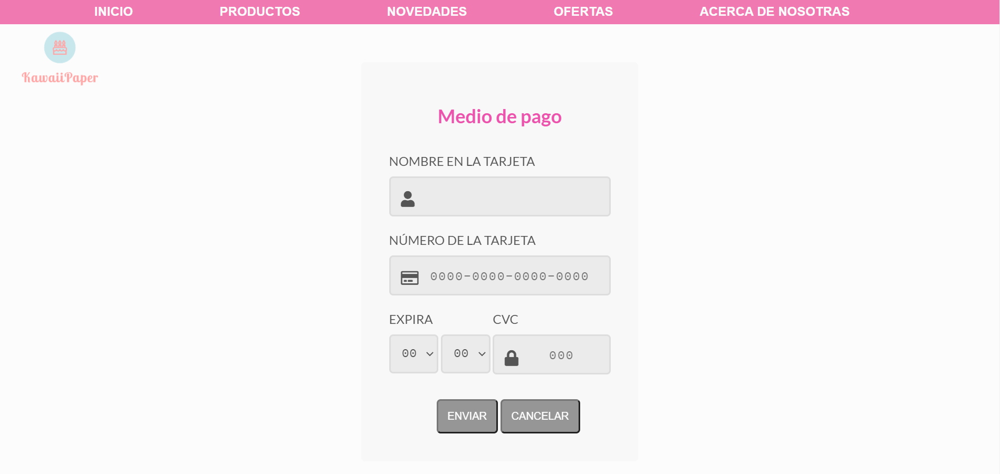
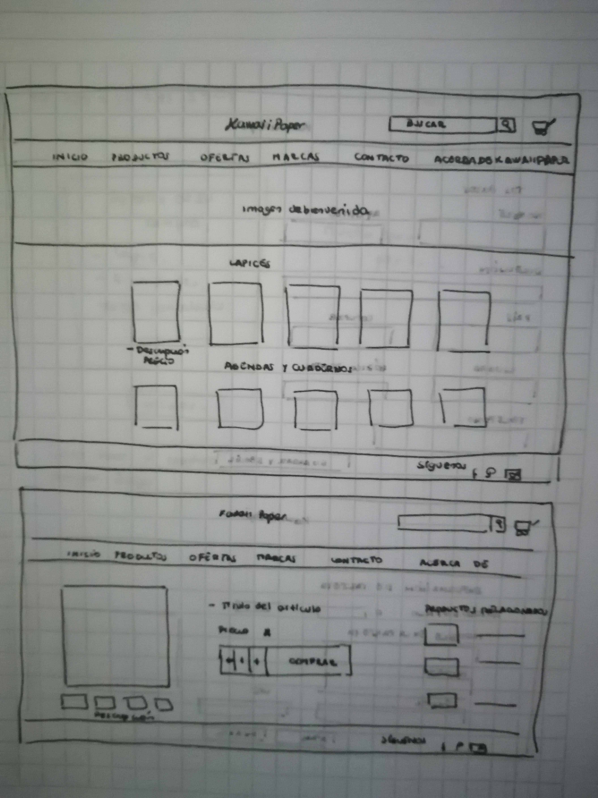

# KawaiiPaper: Papelería online

Tienda KawaiiPaper : Papelería online con temática kawaii

## 1. Sobre el proyecto

KawaiiPaper es una tienda online que ofrece artículos de papelería a sus usuarias y usuarios que prefieran artículos tiernos o de temática kawaii.

Para comprar un artículo las usuarias deben hacer click en el botón "comprar" el cual las guiará a una descripción
más detallada del producto.Indicando la cantidad de artículos que desean llevar se indica el monto total a pagar,posteriormente son derivadas mediante el botón continuar al método de pago donde deberán ingresar los datos de su tarjeta.Si el número de la tarjeta es inválido o no se indicará en el momento que completen toda la información solicitada.En el caso de que este sea inválido tendrán la opción de ingresar nuevamente el número de la tarjeta o cancelar la compra.Por el contrario, si es válida la tarjeta serán derivadas o derivados a los detalles de la compra efectuada. 

Para validar el número de tarjeta se aplica el algoritmo de Luhn.

## 2. Imagen final del proyecto

## 3. Investigación UX

  1. Las usuarios o usuarios son personas interesadas en adquirir productos de papelería de temática kawaii.
  2. El producto ofrecido satisface la necesidad de comprar objetos de temática kawaii que sean bonitos y útiles.
  3. El prototipo inicial en papel es el siguiente:

     
     

  4.  Feedback recibido de prototipos: Los prototipos iniciales no se podían explicar por sí solos,por lo que hubo que simplificar el diseño para que fuera entendible.Luego   se diseñó en Figma un prototipo el cual al adaptarlo en formato de página web las proporciones de cada elemento eran excesivamente grandes.Este último se modificó hasta hacerlo más entendible y práctico.

## 4. Objetivos propuestos al inciar este proyecto

* Crear una aplicación útil y visualmente atractiva
* Poner en práctica lo aprendido de Javascript, CSS y HTML
* Entender y aplicar el algoritmo de Luhn para validad el número de la tarjeta de crédito.
  
## 5. Objetivos alcanzados en el desarrollo de este proyecto

* Manipulación dinámica del DOM mediante Javascript
* Uso de ciclos y condicionales de Javascript

## 6. Objetivos por alcanzar en los próximos proyectos

* Definir el propósito de la aplicación desde un comienzo
* Diseñar la aplicación pensando y entendiendo al usuario
* Aplicar el feedback entregado e iterar más

## 7. GitHub Pages

https://danielamendezgandara.github.io/SCL017-card-validation/

